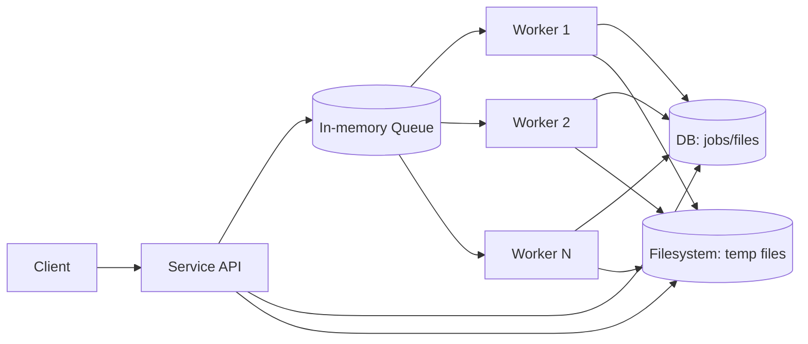
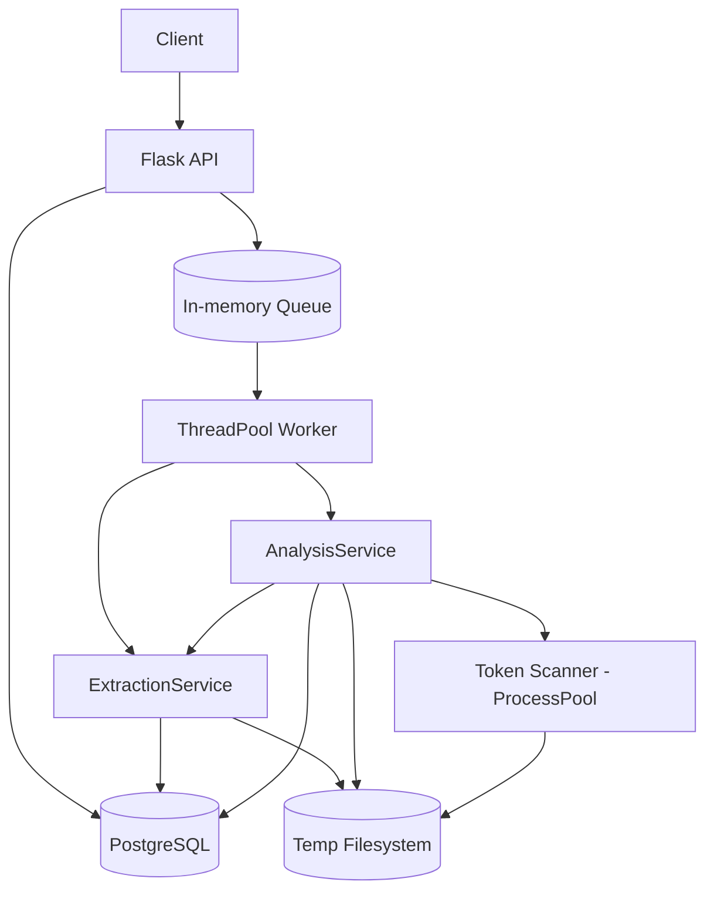
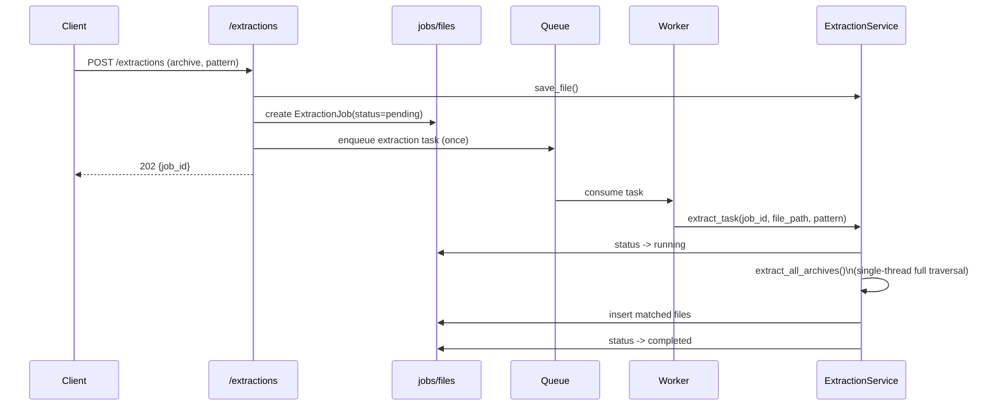
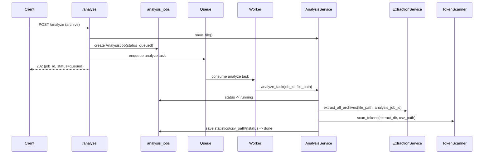

# Archive Extractor Service

## Operating Model

The service receives requests, stores job state in DB, and pushes extraction tasks to an in-memory queue.
Workers consume tasks concurrently, write results to DB, and use temporary files on the filesystem.

## Architecture

### Key points

- Queue is used as a trigger for background jobs.
- Extraction job is enqueued once, then fully processed in one worker flow.
- Nested archive traversal logic is centralized in `ExtractionService.extract_all_archives` and reused by analysis.
- Token scan runs in process pool (`spawn`) inside token scanner.

## Extraction Request Flow

### Extraction behavior

- No recursive re-enqueue for nested archives.
- Nested archives are processed inside one worker task.
- Job status updates are persisted as `pending -> running -> completed` (or `failed`).

## Analysis Request Flow

### Analysis behavior

- Analysis reuses extraction traversal module (`extract_all_archives`) rather than duplicating archive traversal logic.
- Token counting is parallelized in process pool, while API/worker flow remains synchronous per task.
