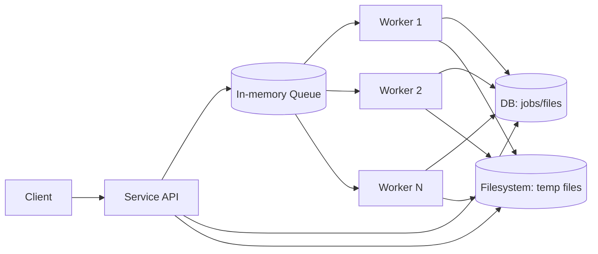

# Archive Extractor Service

## Operating Model

The service receives requests, stores job state in DB, and pushes extraction tasks to an in-memory queue.
Workers consume tasks concurrently, write results to DB, and use temporary files on the filesystem.
